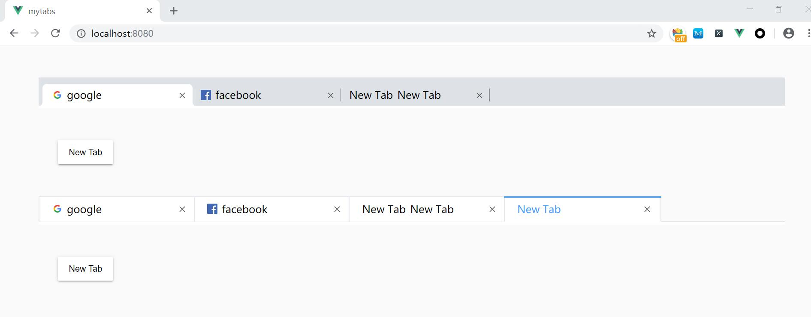

# mytabs

### 初学 vue 实现了 tab 的新增 删除 选中 ；拖拽效果暂未实现



## Project setup

```
yarn install
```

### Compiles and hot-reloads for development

```
yarn serve
```

### Compiles and minifies for production

```
yarn build
```

### Lints and fixes files

```
yarn lint
```

### Customize configuration

See [Configuration Reference](https://cli.vuejs.org/config/).
